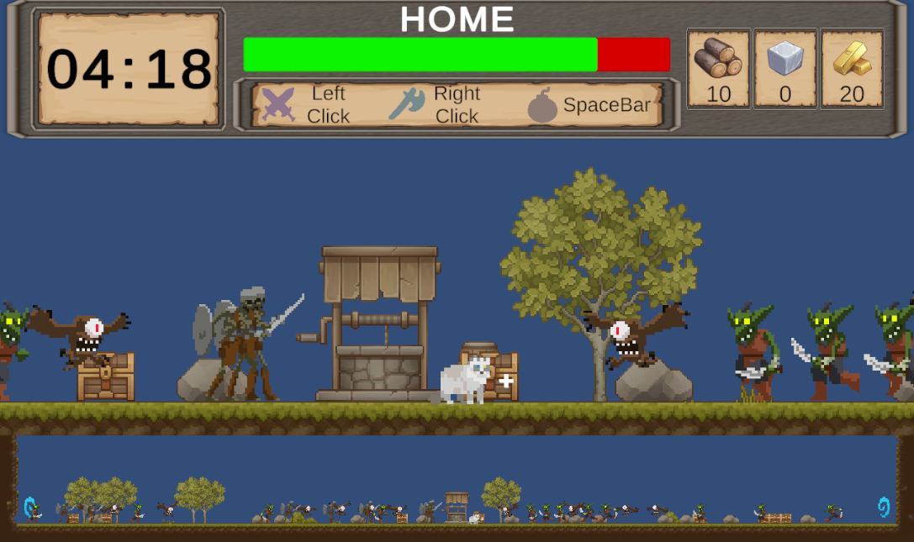
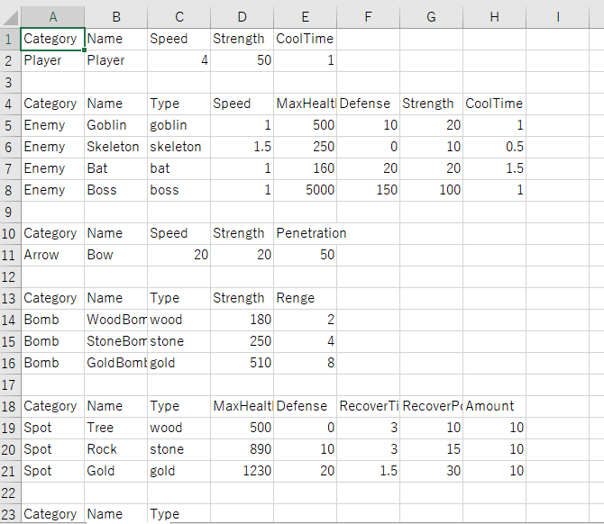

# KeepWorking
## KeepWorkingについて
プレイヤーである猫を操作して、家である井戸を敵から守り抜くゲームです。
資源を集めながら弓矢や爆弾を使って5分間耐え抜きます。

敵の種類を増やし経過時間に合わせて出現間隔を変化させることでゲームが単調にならないように気を付けました。

[ゲームのサンプルプレイ](https://azumasato4.github.io/KeepWorking_web/)



### 操作方法
- Aキー（左キー）：左に移動
- Dキー（右キー）：右に移動
- スペースキー：爆弾を設置
- マウス左クリック：弓矢を発射
- マウス右クリック：素材を入手

### ゲームルール
- 敵の攻撃で家である井戸の耐久値が0になったらゲームオーバー
- 敵は弓矢か爆弾による攻撃で撃破可能
- 爆弾を使うには素材を入手する必要がある（1爆弾で1素材消費）
- 残り時間が0になっても井戸の耐久値が残っていればゲームクリア

## 使用技術
- ゲームエンジン：Unity
- 使用言語：C#
- 使用ツール：VisualStudio

## 開発の工夫
- 開発期間：20時間
- 担当範囲：アセットの導入、プログラミング、デバッグ仕上げ
- こだわった点：  
CSVファイルを使用したパラメーター調整  
アニメーションカーブを使用した敵の出現間隔調整  
InputSystemを使用した入力制御  
- 技術的な調整：  
CSVファイルをゲーム内に取り込めるように設計し、その情報をキャラに代入するのに苦労しました。

### スクリプトの詳細
- CSVDataBase.csとCSVReader.cs  
Excelで制作したファイルを取り込んで保管
WebGLでの実行は読み取り方を変更して対応した



```c#
public class CSVDataBase
{
    public static PlayerStatus playerStatus;
    public static List<SpotStatus> spotStatus = new List<SpotStatus>();
    public static List<EnemyStatus> enemyStatus = new List<EnemyStatus>();
    public static ArrowStatus arrowStatus;
    public static List<BombStatus> bombStatus = new List<BombStatus>();
    public static List<ResourceData> resources = new List<ResourceData>();
}

```

```c#
public class CSVReader : MonoBehaviour
{
    static bool isRead;

    void Awake()
    {
        if (isRead) return;
        StartCoroutine(FindFile());
    }

    IEnumerator FindFile()
    {
#if UNITY_WEBGL
        //StreamingAssetsフォルダのCSVファイルパスを取得
        string path = Application.streamingAssetsPath + "/GameData.csv";
        using (var request = UnityEngine.Networking.UnityWebRequest.Get(path))
        {
            yield return request.SendWebRequest();
            if (request.result == UnityEngine.Networking.UnityWebRequest.Result.Success)
                ReadData(request.downloadHandler.text.Split('\n'));
            else
                Debug.LogError("CSV読み込み失敗: " + request.error);
        }
#else
        //StreamingAssetsフォルダのCSVファイルパスを取得
        string filePath = Path.Combine(Application.streamingAssetsPath, "GameData.csv");

        //ファイルを読み込む
        if (File.Exists(filePath))
        {
            string[] lines = File.ReadAllLines(filePath);
            ReadArrowData(lines);
        }
        else
        {
            Debug.LogError("CSVファイルが見つかりませんでした: " + filePath);
        }
#endif
        isRead = true;
    }

    void ReadData(string[] lines)
    {
        foreach (string line in lines)
        {
            string[] values = line.Split(',');
            switch (values[0])
            {
                case "Category":
                    continue;
                case "Player":
                    ReadPlayerData(values);
                    break;
                case "Enemy":
                    ReadEnemyData(values);
                    break;
                case "Arrow":
                    ReadArrowData(values);
                    break;
                case "Bomb":
                    ReadBombData(values);
                    break;
                case "Spot":
                    ReadSpotData(values);
                    break;
                case "Resource":
                    ReadResourceData(values);
                    break;
            }
        }
    }

    void ReadPlayerData(string[] values)
    {
        string name = values[1];
        float moveSpeed = float.Parse(values[2]);
        float strength = float.Parse(values[3]);
        float coolTime = float.Parse(values[4]);
        Debug.Log($"{name},{moveSpeed},{strength},{coolTime}");

        CSVDataBase.playerStatus = new PlayerStatus(moveSpeed, strength, coolTime);
    }

    void ReadEnemyData(string[] values)
    {
        string productName = values[1];
        string enemyType = values[2];
        float moveSpeed = float.Parse(values[3]);
        float maxHealth = float.Parse(values[4]);
        float defense = float.Parse(values[5]);
        float strength = float.Parse(values[6]);
        float coolTime = float.Parse(values[7]);
        Debug.Log($"{productName},{enemyType},{moveSpeed},{maxHealth},{defense},{strength},{coolTime}");

        Enemy.EnemyType type = Enemy.EnemyType.goblin;
        switch (enemyType)
        {
            case "goblin":
                type = Enemy.EnemyType.goblin;
                break;
            case "skeleton":
                type = Enemy.EnemyType.skeleton;
                break;
            case "bat":
                type = Enemy.EnemyType.bat;
                break;
        }

        CSVDataBase.enemyStatus.Add(
            new EnemyStatus(productName, type, moveSpeed, maxHealth, defense, strength, coolTime)
            );
    }


    void ReadArrowData(string[] values)
    {
        string productName = values[1];
        float shotSpeed = float.Parse(values[2]);
        float strength = float.Parse(values[3]);
        float penetration = float.Parse(values[4]);
        Debug.Log($"{productName},{shotSpeed},{strength},{penetration}");

        CSVDataBase.arrowStatus = new ArrowStatus(productName, shotSpeed, strength, penetration);
    }

    void ReadBombData(string[] values)
    {
        string productName = values[1];
        string turretType = values[2];
        float strength = float.Parse(values[3]);
        float renge = float.Parse(values[4]);
        Debug.Log($"{productName},{turretType},{strength},{renge}");

        Bomb.BombType type = Bomb.BombType.wood;
        switch (turretType)
        {
            case "wood":
                type = Bomb.BombType.wood;
                break;
            case "stone":
                type = Bomb.BombType.stone;
                break;
            case "gold":
                type = Bomb.BombType.gold;
                break;
        }

        CSVDataBase.bombStatus.Add(
            new BombStatus(productName, type, strength, renge)
            );
    }

    void ReadSpotData(string[] values)
    {
        string productName = values[1];
        string spotType = values[2];
        float maxHealth = float.Parse(values[3]);
        float defense = float.Parse(values[4]);
        float recoverTime = float.Parse(values[5]);
        float recoverPower = float.Parse(values[6]);
        int amount = int.Parse(values[7]);
        Debug.Log($"{productName},{spotType},{maxHealth},{defense},{recoverTime},{recoverPower},{amount}");

        Resource.ResourceType type = Resource.ResourceType.wood;
        switch (spotType)
        {
            case "wood":
                type = Resource.ResourceType.wood;
                break;
            case "stone":
                type = Resource.ResourceType.stone;
                break;
            case "gold":
                type = Resource.ResourceType.gold;
                break;
        }

        CSVDataBase.spotStatus.Add(
            new SpotStatus(productName, type, maxHealth, defense, recoverTime, recoverPower, amount)
            );
    }

    void ReadResourceData(string[] values)
    {
        string productName = values[1];
        string spotType = values[2];
        Debug.Log($"{productName},{spotType}");

        Resource.ResourceType type = Resource.ResourceType.wood;
        switch (spotType)
        {
            case "wood":
                type = Resource.ResourceType.wood;
                break;
            case "stone":
                type = Resource.ResourceType.stone;
                break;
            case "gold":
                type = Resource.ResourceType.gold;
                break;
        }

        CSVDataBase.resources.Add(
            new ResourceData(productName, type)
            );
    }
}
```

- Interfaces.cs  
インターフェースを一か所でまとめて管理し修正しやすくした
```c#
using UnityEngine;

public interface IMovable
{
    float MoveSpeed { get; }

    void Move();
}

public interface ITurnable
{
    void TurnLeft();
    void TurnRight();
}

public interface IAttackable
{
    float Strength { get; }

    void Attack(IDamageable target);
}

public interface IDamageable
{
    float Health { get; }
    float Defense { get; }

    void TakeDamage(IAttackable attack);
    void Dead();
}

public interface IRestoreHealth
{
    void RestoreHealth();
}

public interface ICreatable
{
    void Create();
}

public interface IShotable
{
    void Shot();
}

public interface IProduct
{
    string ProductName { get; }

    void Initialize(int id);
}

public interface IPenetratable
{
    float Penetration { get; }

    void Penetrate(IDamageable target);
}

public interface IExplodable
{
    float FuseDelay { get; }

    void Explode();
}
```

- アニメーションカーブを使用した難易度調整  
敵の出現間隔の変数の値をアニメーションカーブを使って変化させた


```c#
public class EnemySpot : Factory
{
    [SerializeField] Enemy[] _productPrefab;
    [SerializeField] Enemy _boss;
    [SerializeField] AnimationCurve _generateTime; //生成間隔
    float _generateTimer; //生成間隔

    float _timer;

    private void Update()
    {
        if (GameManager.currentState != GameManager.GameState.play) return;
        if (_timer >= _generateTimer)
        {
            _timer = 0;
            GetProduct(transform.position);
        }

        _timer += Time.deltaTime;
        _generateTimer = _generateTime.Evaluate(Time.time);
    }
```

## 今後の展望  
- どの爆弾を使用するかを選択できるようにする
- CSVデータをスクリプタブルオブジェクトに代入できるように学習中
